# Python application-shell workflows

Odon ships reusable layouts for common review, analysis, comparison, mosaic-triage, and
presentation sessions. Each builder returns a complete `ShellLayout`; applying it remains an
explicit revision-guarded transaction.

```python
import odon
from odon import layouts

with odon.connect() as app:
    current = app.ui.shell.get(mode="single")
    desired = layouts.review()
    app.ui.shell.replace_layout(
        desired,
        mode="single",
        if_revision=current.revision,
        transaction_id="install-review-workspace",
    )
```

An extension panel can be inserted into the appropriate workflow tabs using the stable mount ID
returned by registration:

```python
contribution = extension.register(panel, contribution_id="quality-control")
desired = layouts.analysis(panel_mounts=[contribution.shell_mount])
app.ui.shell.replace_layout(desired, mode="single")
```

Other supplied layouts are constructed the same way:

```python
layouts.comparison()
layouts.mosaic_triage()
layouts.presentation(mode="single", show_toolbar=False)
layouts.presentation(mode="mosaic", show_toolbar=True)
```

The review, analysis, comparison, and mosaic-triage layouts include actor-owned default extension
hosts. Contributions explicitly supplied through `panel_mounts` are excluded from their default
host at render time, preventing duplicate UI. Presentation layouts intentionally contain only the
required canvas and optional native toolbar.

## Dataset-specific controlled-shell example

[`examples/python_shell_control.py`](../../examples/python_shell_control.py) opens the checked-in
five-channel OME-Zarr fixture, installs a nested review shell, mounts a Python-defined command
toolbar, and binds the right inspector panel's visibility to the actor-owned checked state of
`viewer.scale_bar.toggle`. The toolbar deliberately mixes:

- ready native `project.save`;
- protected control command `app.shell.recover`;
- checked native `viewer.scale_bar.toggle`; and
- predicate-disabled `viewer.masks.export_geojson` while no mask layer exists.

Validate and inspect the desired state without launching Odon:

```bash
uv run --project python python examples/python_shell_control.py --plan-only
```

Run the complete workflow against a running app, or let it launch the repository debug binary:

```bash
uv run --project python python examples/python_shell_control.py
uv run --project python python examples/python_shell_control.py --launch
```

The live macOS run on 2026-08-25 produced this actor-owned output before restoring the previous
layout and toolbar:

```json
{
  "active_region_id": "layout:workflow.review.canvas",
  "dataset": "synthetic_5ch.ome.zarr",
  "layout_nodes": 23,
  "layout_root": "layout:workflow.review.root",
  "mode": "single",
  "opened": true,
  "right_panel_visible": true,
  "scale_bar_checked": true,
  "shell_revision": 2,
  "toolbar_commands": [
    "project.save",
    "app.shell.recover",
    "viewer.scale_bar.toggle",
    "viewer.masks.export_geojson"
  ],
  "toolbar_groups": 2,
  "toolbar_revision": 2
}
```

The optional `--capture` mode records both effective states from one run. In the first frame the
scale-bar action is selected, mask export is actor-disabled, and the bound inspector occupies the
right side. The example then executes the same checked command through `ui.commands.execute`.

| Checked command and visible inspector | Unchecked command and hidden inspector |
| --- | --- |
| 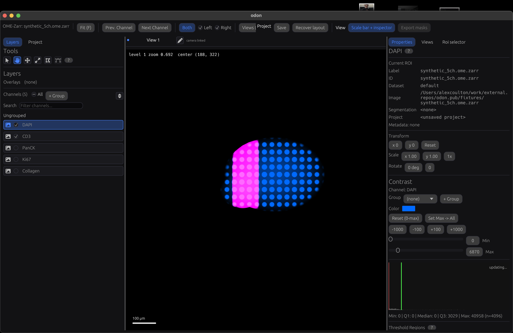 | 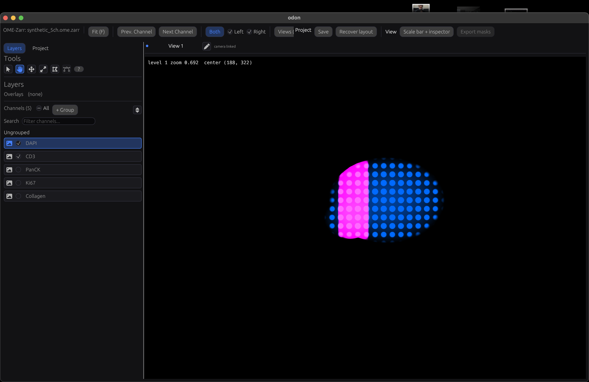 |

After the command, the actor reported:

```json
{
  "right_panel_visible": false,
  "scale_bar_checked": false,
  "shell_revision": 2
}
```

The shell document revision remains 2 because the command changes actor-derived effective
visibility, not the persisted desired layout. No Python frame callback or follow-up layout patch is
involved; the canvas takes the released inspector space during native reconciliation.

## Adaptive multiplex-review cockpit

[`examples/python_multiplex_review_cockpit.py`](../../examples/python_multiplex_review_cockpit.py)
is a fuller dataset-specific application built through the same public Python API. It opens the
five-channel synthetic fixture and installs a Python-owned **Multiplex review** panel beside the
native Layers, Project, Properties, Views, and ROI components. Four presets atomically choose
channels, colors, contrast windows, the active channel, and a fitted camera:

- Multiplex overview: DAPI, PanCK, and Collagen;
- Nuclear QC: DAPI and Ki67;
- Immune context: DAPI and CD3; and
- Stromal context: DAPI and Collagen.

The panel contributes native controls for choosing a preset, fitting the image, binding smooth
pixel rendering, committing a review note, and flagging the current camera/channel state. Python
receives semantic component and extension-command events, performs the workflow operation, and
patches the native status, progress, and Markdown summary components without rebuilding the panel.

Every review command has one actor-owned identity. That same identity is installed into the
Python panel, a top command toolbar, a **Review** menu in the native macOS menu bar, and the
searchable command palette (`Shift+Cmd+P` on macOS, `Shift+Ctrl+P` elsewhere). Consequently every
entry point produces the same namespaced extension event and Python handler result. Predicate
examples are visible in the UI: **Export review package** is disabled until a mask resource exists,
while **Inspect selected objects** remains hidden until object data exists and is then disabled
until at least one object is selected.

Inspect the complete typed plan, run a deterministic command/event smoke test, or leave the
cockpit open for interaction:

```bash
uv run --project python python examples/python_multiplex_review_cockpit.py --plan-only
uv run --project python python examples/python_multiplex_review_cockpit.py --launch
uv run --project python python examples/python_multiplex_review_cockpit.py --launch --serve
```

The example defaults to `target/release/odon`, avoiding the rendering artifacts caused by an
unoptimised debug build. Its machine-readable output includes all evaluated command states and a
deliberately restricted `ui.shell.read` session: the overview command becomes hidden for that
session, reports missing `viewer.read`, and direct execution returns a structured permission
denial. The installed shell is saved as a named session profile while running. On exit, the
profile, menu, toolbar, palette, layout, and extension are removed or restored; only a process
launched by the example is terminated.

## Cellpose parameter comparison

[`examples/python_cellpose_comparison.py`](../../examples/python_cellpose_comparison.py) turns the
same five-channel fixture into a small segmentation experiment. Python reads PanCK and CD3 as a
cytoplasmic composite, pairs it with DAPI, and runs the current Cellpose-SAM model. One neural
inference is shared by three mask-recovery settings:

- **Permissive** lowers the cell-probability threshold and relaxes flow consistency.
- **Balanced** uses Cellpose's standard thresholds.
- **Conservative** raises the cell-probability threshold and tightens flow consistency.

Each run produces a labelled NumPy array, GeoJSON cell outlines, and summary metrics under
`test_data/cellpose_comparison/`. The generated data is cached and ignored by Git. Odon opens the
fixture, loads the selected GeoJSON through its actor-owned resource API, and renders a native
Python-authored panel that switches runs without changing the camera. The panel reports cell count,
coverage, and area statistics so boundary changes can be judged alongside their quantitative effect.

The script uses inline dependency metadata, keeping Cellpose and PyTorch out of Odon's lightweight
Python client environment. Its first full invocation installs those dependencies into uv's isolated
cache and downloads the pretrained model weights:

```bash
# Inspect the declarative workflow without scientific dependencies.
uv run --project python python examples/python_cellpose_comparison.py --plan-only

# Segment the fixture, launch Odon, and keep the comparison panel interactive.
uv run --script examples/python_cellpose_comparison.py --launch --serve

# Reopen cached results without rerunning Cellpose.
uv run --script examples/python_cellpose_comparison.py --view-only --launch --serve

# Use CUDA or Apple MPS when available, and deliberately refresh the cache.
uv run --script examples/python_cellpose_comparison.py --gpu --force --segment-only
```

Cellpose's pretrained models and annotated training data have separate non-commercial licensing.
Review that licensing before adopting pretrained results in a commercial workflow.

## Large CyCIF Cellpose comparison

[`examples/python_cellpose_large_cycif.py`](../../examples/python_cellpose_large_cycif.py) adapts
the comparison workflow to the 36-channel, 27,299 × 20,045 pixel
`TNP_pilot_cycif.qupath-full.ome.zarr`. The exported OME metadata contains generic channel labels,
so the script reads the adjacent acquisition `markers.csv` and maps DNA1, ECAD, panCK, CD45, CD3D,
and CD8A to their array indices. DNA1 supplies nuclear context; the five cell-associated markers
are percentile-normalized independently and averaged into a cytoplasmic composite.

The earlier MACSima pipeline built a dense full-image label raster while merging provisional tile
IDs. That would require about 2.19 GB for each `int32` result here. The laptop workflow instead uses
2048-pixel tiles with 256 pixels of overlap and writes atomic GeoJSONL checkpoints. A cell belongs
to the tile whose inner half-overlap region contains its centroid. The retained tile therefore has
context around the complete cell, while adjacent predictions do not create duplicate output.
Finished tiles are skipped on the next invocation, and final Odon GeoJSON files are assembled by
streaming checkpoints rather than holding the complete segmentation in memory.

One Cellpose 3.1 `cyto2` inference is reused for three mask-recovery settings per tile:

- **Legacy permissive** reproduces `cellprob=-6`, `flow=2`, and `min_size=200` from the earlier script.
- **Balanced** uses `cellprob=-2` and `flow=0.8`.
- **Conservative** uses Cellpose's standard `cellprob=0` and `flow=0.4`.

Typical commands are:

```bash
# Dependency-free plan: marker mapping, shape, tile count, and memory avoided.
uv run --project python python examples/python_cellpose_large_cycif.py --plan-only

# Benchmark one central tile without writing segmentation output.
uv run --script examples/python_cellpose_large_cycif.py --benchmark --device mps

# Process four representative central tiles and inspect partial results in Odon.
uv run --script examples/python_cellpose_large_cycif.py \
  --max-tiles 4 --device mps --launch --serve

# Resume every remaining tile and write the complete result set.
uv run --script examples/python_cellpose_large_cycif.py --device mps --segment-only

# Open the latest partial or complete cached result without running Cellpose.
uv run --script examples/python_cellpose_large_cycif.py --view-only --launch --serve
```

Outputs default to the external SSD beside the source image because the internal disk cannot safely
hold three whole-slide result sets. Each configuration receives a signature-named run directory,
so changing channels, thresholds, model, diameter, or tile geometry cannot silently mix checkpoints.

### DAPI nuclei tuning and independent-model pilot

The broad cytoplasmic composite is useful as a comparison, but it is not a reliable default for this
heterogeneous slide. Global normalization suppresses locally dim regions, and averaging selective
phenotype markers dilutes their signal. The bounded follow-up workflows therefore use per-tile
percentile normalization and matched central tiles:

```bash
# Six DAPI-only Cellpose nuclei settings, with three shared inferences per tile.
uv run --script examples/python_cellpose_dapi_nuclei_sweep.py \
  --device mps --launch --serve

# Independent InstanSeg DAPI/multiplex comparison on the same two tiles.
uv run --script examples/python_instanseg_large_cycif_pilot.py \
  --device mps --launch --serve
```

On the current fixture, the selected Cellpose candidate is the nuclei model with diameter 18,
`cellprob=-1`, `flow=0.4`, and `min_size=40`. It produces 26,412 nuclei on two matched tiles.
InstanSeg's DAPI-only result produces 32,324 tighter nuclear outlines and is retained as an
independent high-recall candidate. Giving InstanSeg DAPI plus ECAD, panCK, CD45, CD3D, and CD8A
produces about 42,800 nuclei and outlines in DAPI-dark regions; its whole-cell output expands the
nuclei only slightly. Those multiplex outputs are kept as negative controls rather than recommended
whole-cell segmentations.

The source OME metadata records one nanometre per level-zero pixel, which is implausible for this
acquisition. The InstanSeg pilot therefore records an explicit 0.5 µm/px assumption in its signed
configuration. Confirm that value from acquisition metadata before a production run.

The viewer workflow also derives intensity-filled object layers without rerunning segmentation. It
rasterizes every Cellpose and InstanSeg polygon on its source tile, calculates the exact level-zero
mean of Channel 1, and stores the numeric value as `mean_channel_1`. All four enriched GeoJSON
results use Odon's native continuous object styling with the same explicit minimum, maximum, and
Viridis palette. A colour therefore represents the same intensity in every result; no quantile or
other categorical surrogate is generated. The derived GeoJSON and result sidecars are
signature-cached beside the pilot outputs.

## Actor-owned default extension host lifecycle

[`examples/python_extension_host_control.py`](../../examples/python_extension_host_control.py)
registers a native egui panel from a separate Python extension session and lets the review layout's
existing `builtin:extension-host.left-sections` mount place it. The controller selects that host by
its stable desired-tree node ID; the contribution is not inserted as an explicit layout node.

Inspect the typed plan without a running app, run the lifecycle against an existing instance, or
launch the repository debug binary and pause at each capture stage:

```bash
uv run --project python python examples/python_extension_host_control.py --plan-only
uv run --project python python examples/python_extension_host_control.py
uv run --project python python examples/python_extension_host_control.py --launch --capture
```

The macOS run records three states while preserving shell revision 3:

1. `ready`: the default host renders the Python panel and owns actor focus;
2. `disconnected`: closing only the extension session retains the same shell mount and renders an
   explicit disconnected banner; and
3. `reconnected`: a new session registering the same extension ID and version reclaims the retained
   contribution under a new owner session, removes the banner, and restores interaction.

| Ready | Retained after disconnect | Reclaimed after reconnect |
| --- | --- | --- |
| 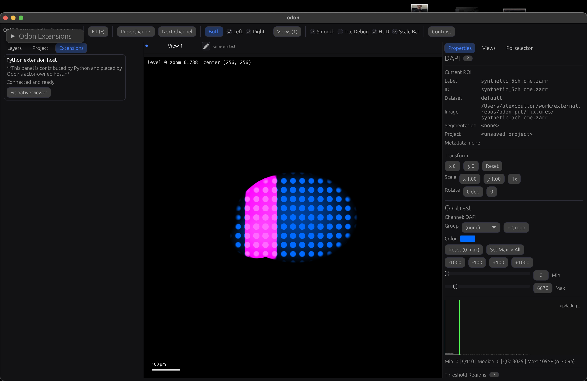 | 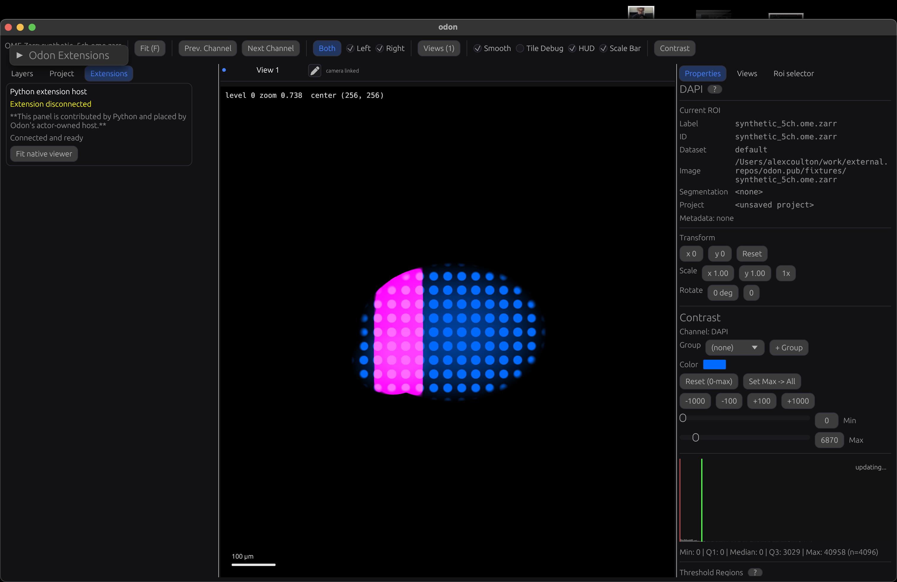 |  |

This capture also found and fixed a compatibility ownership bug: passive projection of the legacy
Layers/Project enum used to overwrite a desired-tree selection that named the extension host.
Passive compatibility projection now updates only its compatibility fields. An explicit legacy tab
command still deliberately updates the desired layout, and a regression test enforces both sides of
that rule.

## Split, selection, focus, collapse, and protected recovery

[`examples/python_shell_interaction_control.py`](../../examples/python_shell_interaction_control.py)
adds a collapsible left region to the nested review layout and records four revision-guarded states.
Its Python patches target the same actor-owned split, tab, collapse, active-region, and focus fields
that native gestures commit; the existing Rust interaction tests prove native split release, tab
click, collapse click, and leaf activation submit that same patch/event path. The example itself is
therefore reproducible Python-initiated state evidence, not a claim that an automated pointer
gesture produced these particular frames.

Inspect the typed plan, run it against an existing app, or launch Odon and pause at every frame:

```bash
uv run --project python python examples/python_shell_interaction_control.py --plan-only
uv run --project python python examples/python_shell_interaction_control.py
uv run --project python python examples/python_shell_interaction_control.py --launch --capture
```

The macOS run on 2026-08-25 produced revisions 2 through 5:

1. `baseline` installs the open 23-node shell with Layers selected and split ratio 0.24;
2. `resized-selected-focused` atomically changes the ratio to 0.36, selects Project, and sets both
   actor-owned active and focused IDs to that Project mount;
3. `collapsed` retains the 0.36 split and Project selection while collapsing `Review panels` and
   transferring active/focused state to the canvas; and
4. `recovered` invokes protected `app.shell.recover` through `ui.commands.execute`, receives the
   `control` handler result, and installs the two-node canvas-only recovery tree.

| Baseline: ratio 0.24 and Layers selected | Ratio 0.36, Project selected and focused |
| --- | --- |
| 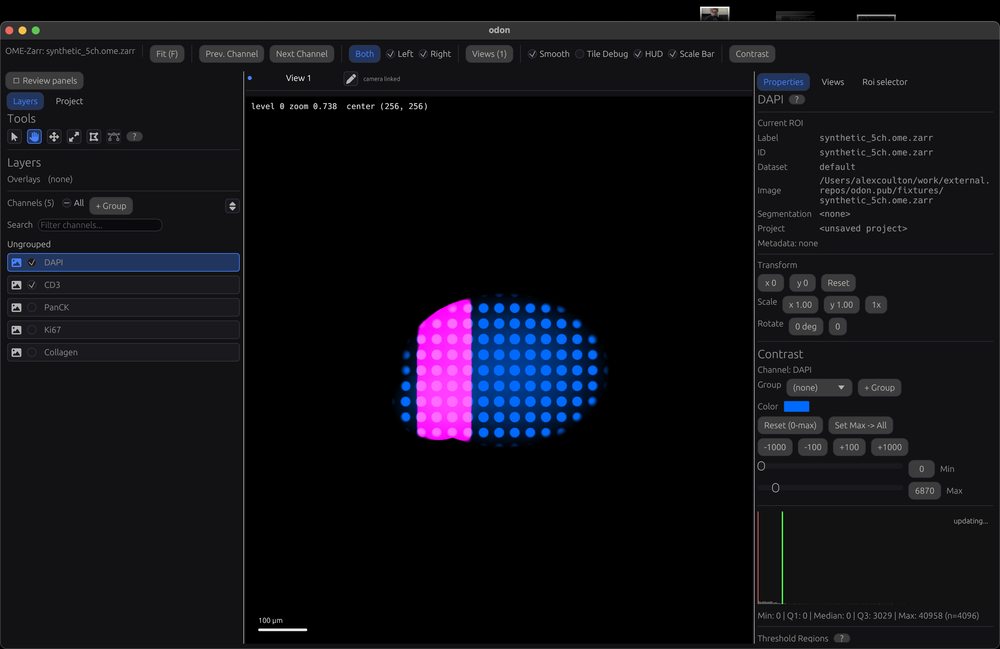 | 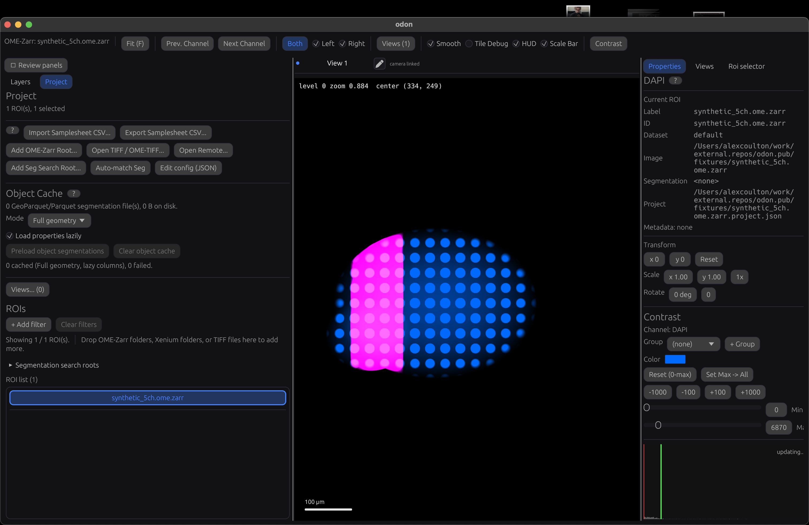 |

| Collapsed Review panels at ratio 0.36 | Protected canvas-only recovery layout |
| --- | --- |
| 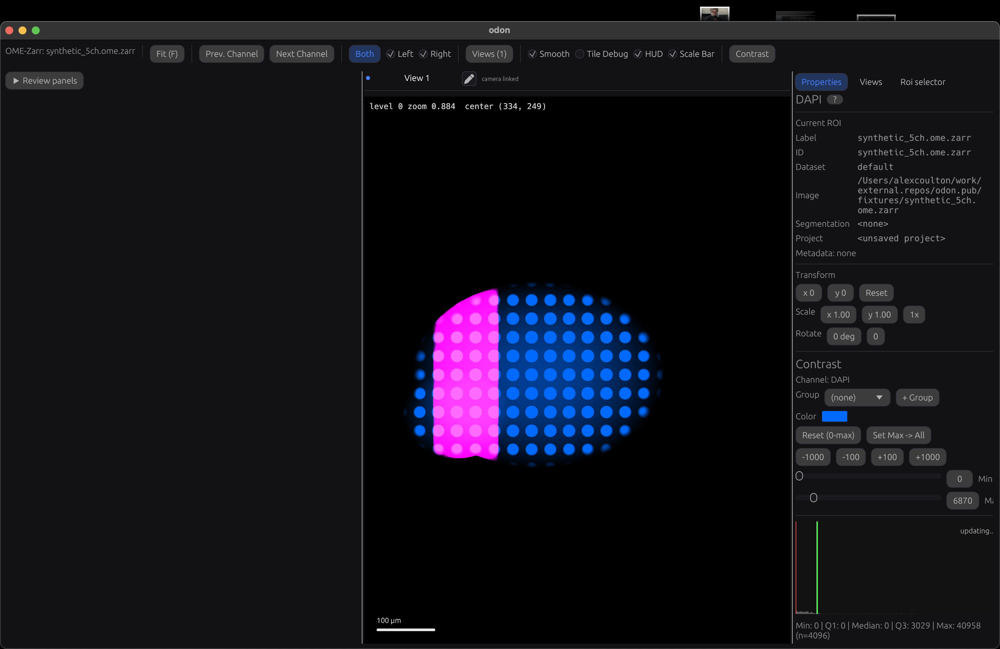 | 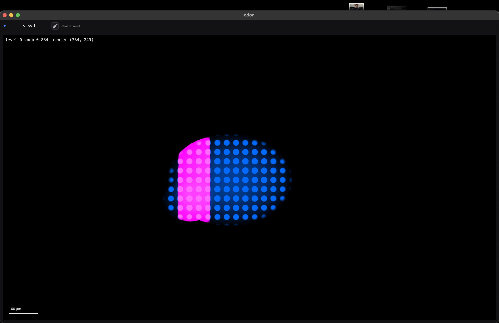 |

The stage output is the machine-readable half of the evidence: it reports the exact split ratio,
selection, collapse flag, active/focused IDs, layout root, revision, recovery handler type, and
recovery canvas mount. The workflow imports the prior shell in `finally` and terminates only an app
process it launched itself.

## Isolated startup restore and mode retention

[`examples/python_shell_startup_mode_control.py`](../../examples/python_shell_startup_mode_control.py)
proves durable application-profile restoration across a real process restart, then switches from
single-view to project mode and back. It launches both processes with a temporary
`ODON_SETTINGS_PATH`, so the qualification run neither reads nor changes the normal OS-user Odon
settings file. The first process activates single-view mode, installs a distinctive 23-node
analysis layout, saves it as an application profile, and selects that profile for single-view
startup. The second process is the evidence process.

```bash
uv run --project python python examples/python_shell_startup_mode_control.py --plan-only
uv run --project python python examples/python_shell_startup_mode_control.py
uv run --project python python examples/python_shell_startup_mode_control.py --capture
```

On macOS, the second process reported `status: restored`, schema version 1, no migration or
protected recovery, the expected `layout:workflow.analysis.root`, split ratio 0.34, and Project tab
selection when single-view mode was first activated. It then set Project active/focused at revision
3, switched to the default project tree, and returned to the same single-view tree at revision 3
with those per-mode IDs retained.

| Application profile restored in the second process | Default project-mode shell |
| --- | --- |
| 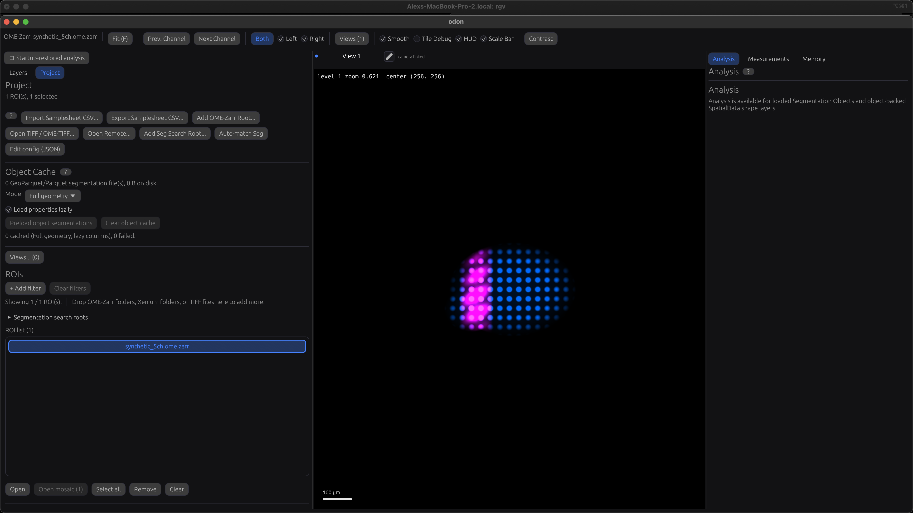 | 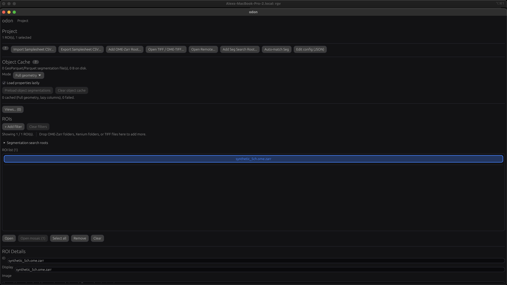 |

| Same single-view shell after returning from project mode |
| --- |
| 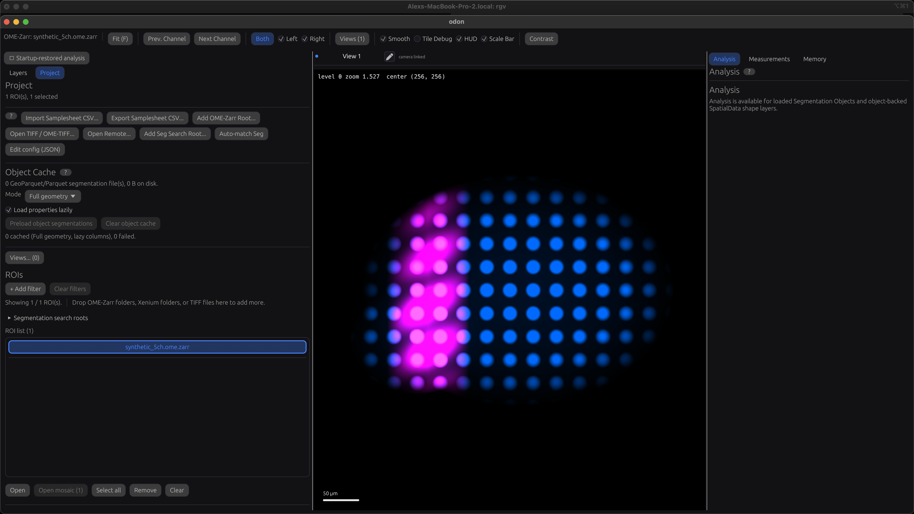 |

The initial restore intentionally restores the layout document rather than transient focus. The
workflow sets active/focused state after restoration, then proves that actor-owned state is retained
when the mode is deactivated and reactivated. The temporary settings directory and both launched
processes are cleaned up in `finally` paths.
