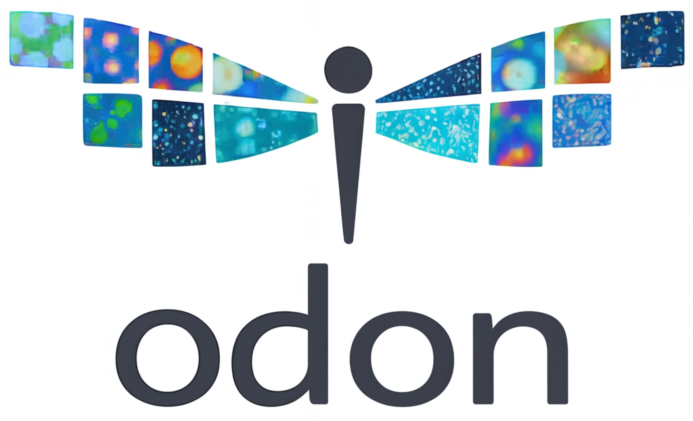

  

  <strong>O</strong>ME-Zarr <strong>D</strong>esktop viewer f<strong>O</strong>r spatial proteomics navigatio<strong>N</strong>

`odon` is a native Rust desktop viewer for multiplex imaging and spatial proteomics data. It is built for fast interactive inspection of large image pyramids, channel overlays, segmentation data, and object annotations without requiring a browser-based stack.

<video class="app-preview-video" autoplay muted loop playsinline controls poster="assets/images/app.preview.png">
  <source src="assets/images/odon.vid.v2.mp4" type="video/mp4">
</video>

## What It Is For

The current viewer is best suited to workflows where you need to:

- inspect OME-Zarr imagery interactively
- compare many markers quickly
- review segmentation outlines, points, and polygon annotations
- work across many ROIs in a mosaic layout
- load project files or samplesheets that define a spatial proteomics workspace

## Core Capabilities

- GPU-backed image compositing for multi-channel data
- per-channel color and contrast controls
- mosaic viewing for many ROIs on one canvas
- overlays for points, labels, masks, and segmentation objects
- object loading from GeoParquet, Parquet, GeoJSON, and CSV
- support for SpatialData and selected Xenium workflows

## Start Here

If you are new to the viewer, use this order:

1. Read [Getting Started](getting-started.md).
2. Open [Viewing Channels](workflows/viewing.md) for the day-to-day viewer controls.
3. Use [Objects and Overlays](workflows/objects-and-overlays.md) if you are loading cells, masks, or points.
4. Use [Mosaic Mode](workflows/mosaic.md) if you want to compare many ROIs.

## Supported Data At A Glance

Primary workflows:

- OME-Zarr / OME-NGFF imagery
- GeoParquet and GeoJSON object data
- Project JSON workspaces
- samplesheet-driven mosaic layouts

Secondary or compatibility workflows:

- SpatialData containers
- Xenium Explorer datasets
- TIFF / OME-TIFF inputs

## Scope

`odon` is a viewer and lightweight annotation tool. It is not trying to reproduce the full analysis surface of larger pathology suites. The emphasis is on viewing, gating, annotation, and export around spatial proteomics data.
